# TheSpeedCubing
<!--TheSpeedCubing/TheSpeedCubing is a ✨ special ✨ repository because its `README.md` (this file) appears on your GitHub profile.
You can click the Preview link to take a look at your changes.
--->
- Github Organization: https://github.com/speedcubing-top

### Pages
- Website: https://speedcubing.top
- Notes: https://speedcubing.top/notes
- HackMD: https://hackmd.io/@speedcubing
- World Cube Association: https://www.worldcubeassociation.org/persons/2018TSAI03

### Contact
- Email: speedcubing@speedcubing.top
- PGP: https://speedcubing.top/pub.asc / 7AEEEBC606BBCAB243C3E9C86D8E805D22322628

